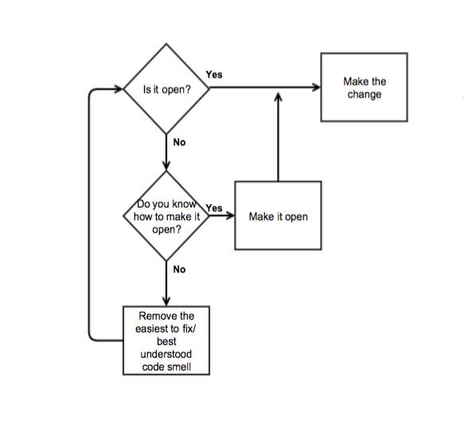

# 99bottles_js

99 Bottles of is a book that taught me:

- a shameless green code building, the more simpler code i write the easier it will be to refactor or build around that code for future changes;
- flocking rules of refactoring code, to reduce code duplication when receiving new requirements;

